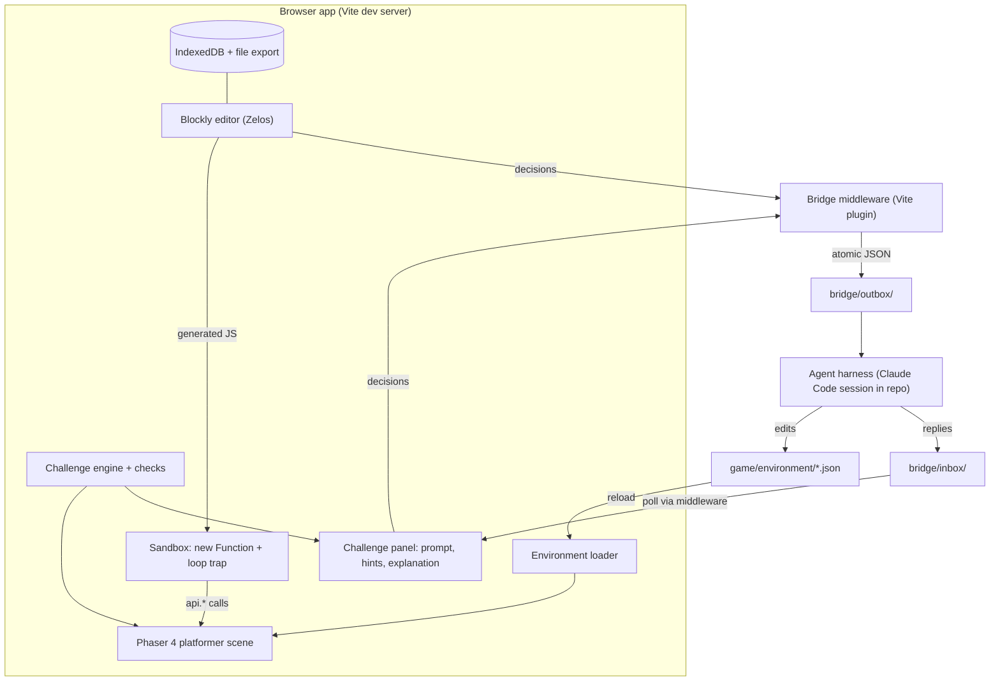
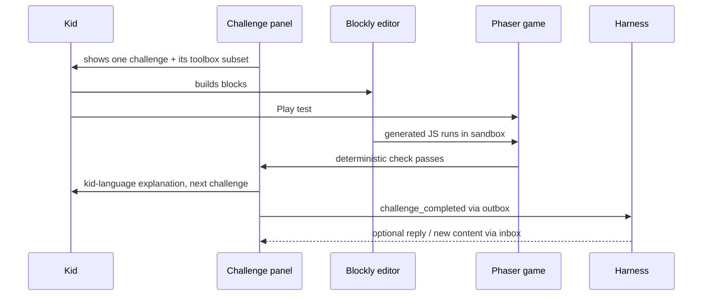

# Kid-Led Game Builder Platformer v1 - Plan

## Goal Capsule

- **Objective:** Build the first version of the kid-led game builder: a local browser app where a child completes six platformer challenges with Blockly blocks driving a Phaser 4 game, while an agent harness running in this repo generates and updates the game environment through a file bridge.
- **Authority:** This plan governs implementation. `FABLE_BUILD_PLAN.md` governs product intent. Repo conventions do not exist yet; this plan establishes them.
- **Execution profile:** Greenfield TypeScript + Vite app, local dev server only. No backend, no Claude API in the app.
- **Stop conditions:** Surface instead of guessing if the bridge protocol proves unworkable for a live harness session, or if a change would alter product scope (new genres, accounts, in-app AI).
- **Tail ownership:** Implementer verifies the Definition of Done, including the manual six-challenge playthrough.

---

## Product Contract

### Summary

This plan implements the platformer first version end-to-end: app shell, environment-driven Phaser 4 game, Blockly editor with an instant in-browser play-test loop, the six authored challenges, the harness file bridge, and local-first persistence. Other genres, direct JS editing, sharing beyond file export, and parent/teacher controls are deferred.

### Problem Frame

Children can play games and can follow tutorials, but tools rarely let them own the creative logic while something else absorbs the setup and repetitive technical work. The origin doc defines a platform that generates a playable starter game and then hands the child small, meaningful coding challenges whose effects appear immediately in their own game (see origin: `FABLE_BUILD_PLAN.md`). This plan builds the smallest complete version of that loop: one genre, six challenges, one child at one machine, with the agent harness as the platform brain.

### Requirements

**Creation flow**

- R1. The child describes a game idea and selects a genre; platformer is selectable, the other five genres are visible but locked.
- R2. The harness generates a playable starter environment (character, basic level, movement) from the child's idea; the app falls back to a bundled starter environment when no harness responds.
- R3. The app presents one challenge at a time in an in-game challenge panel.
- R4. Pressing Play test runs the child's block program immediately in the browser; no harness round-trip is on this path.
- R5. On challenge completion the app explains the result in simple language and offers the next challenge; hints are staged reveals, available on demand.

**Child-facing editor**

- R6. The editor is a Scratch-style block editor: colorful draggable blocks with visual nesting (Blockly Zelos renderer).
- R7. Blocks cover events, movement, jumping, collisions, spawning (platforms, collectibles), enemy patrol, win conditions, variables, scoring, timers, conditions, and sounds — the vocabulary the six challenges need.
- R8. The editor supports undo, reset, and save.
- R9. Errors and incomplete rules are explained in kid language describing the game effect, never as technical errors.
- R10. A read-only JavaScript view beside the blocks shows the generated code and updates as blocks change.
- R11. The toolbox shows only the block categories relevant to the current challenge, unlocking more as challenges complete.

**Platform loop and safety**

- R12. Child decisions (new game idea, challenge completed, free-form creative requests) are written as JSON files to a bridge outbox that a harness session consumes; harness responses arrive through a bridge inbox and environment file updates.
- R13. The child's generated code runs against a constrained game API with infinite-loop protection; it never gets direct access to Phaser internals or the DOM.
- R14. Projects (workspace, challenge progress) persist locally across reloads and support export to and import from a single file.

**V1 content**

- R15. The six origin challenges ship as authored content: add a platform, make the character jump, add a collectible, increase score on collect, make an enemy patrol, set a win condition.

### Success Criteria

- A child goes from a game idea to a complete playable platformer using blocks only.
- The child can see that their own logic caused visible changes (play test is instant, explanations reference what they built).
- The environment schema and challenge format are genre-neutral enough that a second genre would be new content, not a rewrite.

### Scope Boundaries

**Deferred for later** (from origin: `FABLE_BUILD_PLAN.md`)

- The other five genre templates (top-down adventure, racing, sports, puzzle, shooter).
- Direct JavaScript editing for advanced children (the JS view stays read-only in v1).
- Sharing beyond file export; parent/teacher controls; accounts and cloud saves.

**Deferred to Follow-Up Work**

- Production build and hosting — v1 runs only under the Vite dev server, which the bridge middleware requires.
- In-app content filtering for free-form requests — requests go to the harness verbatim; the harness applies judgment.
- Sound and art authoring tools — v1 ships placeholder assets the harness can re-theme.
- Voice input for the idea intake.

---

## Planning Contract

### Key Technical Decisions

- KTD1. **Phaser 4** (session-settled: user-directed — chosen over Phaser 3: v3 closed at 3.90.0 in May 2025; v4 (4.2.x) is the current stable with the same API shape for sprites, tilemaps, arcade physics). Use the official `phaserjs/template-vite-ts` shape as the starting point.
- KTD2. **Blockly v13** with the Zelos renderer, JSON block definitions, JSON workspace serialization, and the `javascript` generator (session-settled: user-directed — chosen over a custom block UI: drag-drop, nesting, serialization, and codegen come for free, and the generated-JS view satisfies R10 directly). XML serialization is legacy; do not use it.
- KTD3. **The agent harness is the platform brain** (session-settled: user-directed — chosen over in-app Claude API and scripted-only alternatives). The harness owns `game/environment/*`: level layout, theme, challenge content. The app never generates content; it renders environment data and reports decisions.
- KTD4. **File bridge via Vite dev-server middleware** (session-settled: user-directed — chosen over batch harness runs and a WebSocket bridge server). The app POSTs decisions to a middleware endpoint that writes atomic JSON files (temp file + rename) into `bridge/outbox/`; the harness consumes them and writes replies to `bridge/inbox/`, which the app polls. Governs R12.
- KTD5. **Local-first persistence: IndexedDB plus file export** (session-settled: user-directed — chosen over a hosted backend). IndexedDB is the working store (async, structured objects, no 5MB cap); export/import to a `.json` file is the durable backup since browsers can evict IndexedDB. Governs R14.
- KTD6. **Sandbox is `new Function('api', code)` with Blockly's `INFINITE_LOOP_TRAP`** (session-settled: user-directed — chosen over JS-Interpreter: the threat model is one child on the family machine running their own code, so full VM isolation buys nothing; the loop trap and the constrained `api` surface carry the real protection). This is a convenience boundary, not a security boundary — record that in code once, at the sandbox module. Governs R13.
- KTD7. **Play test runs entirely in the browser** (session-settled: user-approved — chosen over routing block edits through the harness: feedback must be instant even when the harness is idle). The harness loop handles environment changes and creative requests only. Governs R4.
- KTD8. **Challenge completion is detected in-app by named deterministic predicates** over game/session state (session-settled: user-approved — chosen over live harness judging: instant, offline, testable). Completion is then reported through the bridge. Governs R5, R12.
- KTD9. **Environment is data, not code.** The harness writes validated JSON (`environment.json`, `challenges.json`), never TypeScript, so a malformed harness edit degrades to a kid-language error and fallback rather than a build break, and Vite reload stays trivial.
- KTD10. **Progressive toolbox.** Research on Scratch discoverability shows a full palette overwhelms this age group; each challenge declares its toolbox subset and completed challenges unlock categories. Governs R11.

### High-Level Technical Design

Component and data flow — the left loop (kid ↔ game) is synchronous and instant; the right loop (app ↔ harness) is asynchronous file exchange:



The challenge loop, including the harness's asynchronous role:



### Bridge protocol (directional)

Message envelope: `{ id, type, at, payload }`. Outbox types: `new_game_idea`, `challenge_completed`, `free_request`, `progress_snapshot`. Inbox types: `environment_updated`, `message` (kid-facing text). The middleware names outbox files itself (`<timestamp>-<type>.json`) and ignores any client-supplied paths. `HARNESS.md` specifies the consumer contract: process oldest first, read files only after their size is stable, move processed files to `bridge/outbox/processed/`, validate environment edits against the schema before writing, and write inbox replies atomically (temp file + rename into `bridge/inbox/`, mirroring the outbox rule). Inbox reads skip a file that fails to parse and retry it on the next poll. Exact field lists are settled in U7, not here.

### Deferred implementation notes

- Exact block set and per-challenge toolbox contents are tuned while building U4/U6 against the real challenges.
- Hint and explanation copy is starter-authored in U6; the harness may rewrite it later through `challenges.json`.
- Placeholder art style (simple shapes vs. a free sprite pack) is an implementation choice in U2.

---

## Output Structure

Scope declaration, not a constraint — units' Files lists stay authoritative:

```text
kids-game-dev/
├── index.html
├── package.json
├── vite.config.ts            # dev server + bridge middleware plugin
├── HARNESS.md                # harness consumer contract for the bridge
├── FABLE_BUILD_PLAN.md       # origin product doc
├── bridge/
│   ├── outbox/               # app → harness (atomic JSON)
│   └── inbox/                # harness → app
├── game/
│   └── environment/          # harness-owned content
│       ├── environment.json
│       └── challenges.json
├── src/
│   ├── main.ts
│   ├── game/                 # Phaser 4 scene, environment schema + loader
│   ├── blocks/               # block definitions, generators, toolbox, editor setup
│   ├── runtime/              # game API, sandbox, kid-error mapping
│   ├── challenges/           # challenge engine, completion checks
│   ├── bridge/               # client for outbox/inbox
│   ├── storage/              # IndexedDB, export/import
│   └── ui/                   # panels: challenge, JS view, intake, play-test controls, shared kid notice
└── (tests colocated as *.test.ts)
```

---

## Implementation Units

Phased: A Foundation (U1-U3), B Kid experience (U4-U6), C Harness loop and durability (U7-U9).

### U1. Project scaffold

- **Goal:** A bootable Vite + TypeScript + Phaser 4 app with test tooling and scripts.
- **Requirements:** Foundation for all units.
- **Dependencies:** None.
- **Files:** `package.json`, `vite.config.ts`, `index.html`, `src/main.ts`, `src/game/boot.ts`, `vitest.config.ts`.
- **Approach:** Adapt the official `phaserjs/template-vite-ts` layout to Phaser 4. Guard HMR with `import.meta.hot.dispose(() => game.destroy(true))` — Vite does not tear down Phaser instances and duplicate canvases result. Scripts: `dev`, `test` (vitest), `typecheck`, `build`.
- **Test scenarios:** Test expectation: none — pure scaffolding. Verification is `npm run typecheck` passing and the dev server showing a Phaser canvas without console errors, including after a hot reload.
- **Verification:** App boots; hot reload does not duplicate the canvas.

### U2. Environment schema, loader, and starter level

- **Goal:** The game renders entirely from harness-owned environment data.
- **Requirements:** R2 (fallback starter), R15 baseline; the genre-neutrality success criterion shapes the schema.
- **Dependencies:** U1.
- **Files:** `game/environment/environment.json`, `src/game/environmentSchema.ts`, `src/game/environmentLoader.ts`, `src/game/PlatformerScene.ts`, `src/game/environmentLoader.test.ts`.
- **Approach:** Zod schema for the environment: theme/palette, player spawn, platforms, collectibles, enemies (patrol extents), goal object, sound refs. The scene builds arcade-physics groups from data. Bundled placeholder assets (simple shapes or a free sprite pack) that theme data can recolor. A schema violation surfaces a kid-language message in the shared notice component (cite R9) and loads the bundled starter instead (cite KTD9).
- **Test scenarios:**
  - Valid environment JSON parses and yields the expected platform, collectible, and enemy counts.
  - Environment missing an optional section (no enemies) loads with that group empty.
  - Malformed environment (bad type, missing spawn) is rejected, the kid-language error is produced, and the bundled starter is returned as fallback.
  - Unknown extra fields are ignored, not fatal (harness may add fields before the app understands them).
- **Verification:** Editing `environment.json` by hand changes the rendered level after reload.

### U3. Game API and sandbox runtime

- **Goal:** Generated kid code runs safely against a constrained game API.
- **Requirements:** R13; provides the target surface for R7.
- **Dependencies:** U1 (testable against a fake game state before U2 integration).
- **Files:** `src/runtime/gameApi.ts`, `src/runtime/sandbox.ts`, `src/runtime/kidErrors.ts`, `src/runtime/sandbox.test.ts`, `src/runtime/gameApi.test.ts`.
- **Approach:** `api` exposes event hooks (`onStart`, `onKey`, `onCollect`, `onTouch`) and commands (movement, jump, spawn platform/collectible, score, timers, conditions helpers, `playSound`, `patrol`, `win`). The sandbox is `new Function('api', code)` with `INFINITE_LOOP_TRAP` configured on the generator (cite KTD6). Runtime errors map to game-effect wording in `kidErrors.ts` (cite R9) — e.g. an unset handler reads as "nothing happens when…", never a stack trace.
- **Execution note:** Implement test-first — the API contract is the spine of the whole product and is cheap to specify as tests before Phaser is involved.
- **Test scenarios:**
  - A code string registering `onStart` movement mutates the fake game state as expected.
  - A `while (true)` code string throws the loop-trap error instead of hanging, and the error maps to a kid-language message.
  - Each API command produces its documented state change on the fake state (one scenario per command group: movement, spawning, scoring, timers, sound, patrol, win).
  - A thrown runtime error inside kid code is caught and returned as a kid-language message, not propagated.
  - Running a program twice does not double-register event handlers (reset between runs).
- **Verification:** `npm test` covers the full API surface; no test touches a real Phaser instance.

### U4. Blockly editor and custom blocks

- **Goal:** A Scratch-style editor whose blocks generate calls into the game API, with a live read-only JS view.
- **Requirements:** R6, R7, R8, R10, R11 (mechanism; content arrives in U6).
- **Dependencies:** U1; generator output targets U3's API.
- **Files:** `src/blocks/definitions.ts`, `src/blocks/generators.ts`, `src/blocks/toolbox.ts`, `src/blocks/editor.ts`, `src/ui/jsView.ts`, `src/blocks/generators.test.ts`, `src/blocks/serialization.test.ts`.
- **Approach:** `Blockly.defineBlocksWithJsonArray` for the block set of R7; `javascriptGenerator.forBlock` emits `api.*` calls; Zelos renderer with a bright theme; workspace JSON serialization for save/load (cite KTD2); undo/reset via Blockly built-ins (R8). The JS view renders `workspaceToCode` output on every change, read-only. Toolbox is built from a category-subset descriptor so U6 can filter per challenge (cite KTD10).
- **Test scenarios:**
  - Each block type generates the expected `api.*` code (snapshot per block).
  - A composed program (event block wrapping movement + score blocks) generates well-formed nested code.
  - Workspace save → load round-trips to an identical serialized state.
  - Toolbox descriptor with two categories renders only those categories' blocks.
- **Verification:** Dragging blocks updates the JS view; undo and reset behave; reload restores the workspace via U9 once it lands.

### U5. Play-test loop

- **Goal:** One button compiles blocks and runs them in the game instantly; errors surface in kid language.
- **Requirements:** R4, R9.
- **Dependencies:** U2, U3, U4.
- **Files:** `src/ui/playTest.ts`, `src/ui/kidNotice.ts`, wiring in `src/main.ts`, `src/ui/playTest.test.ts`.
- **Approach:** Play test resets the scene to the environment baseline, binds the real scene-backed `api` implementation, and runs the generated code in the sandbox (cite KTD7). A stop/reset control returns to edit mode. Sandbox errors render in the challenge panel area using `kidErrors` wording, through a shared kid-language notice component (`src/ui/kidNotice.ts`) that U2, U8, and U9 also cite for their error and info messages — one consistent surface for everything the app says to the child outside the challenge flow.
- **Execution note:** This unit is integration proof — prefer a small number of integration tests over widening unit mocks.
- **Test scenarios:**
  - A "when game starts, move right" program moves the player during play test (integration: real generator output through the sandbox into a scene-state fake).
  - Two consecutive play tests produce identical behavior (state reset, no duplicated handlers).
  - A program that throws shows the kid-language message and the game returns to edit mode cleanly.
- **Verification:** Manual: block change → Play test → visible behavior change, within a second.

### U6. Challenge system and the six challenges

- **Goal:** One-at-a-time challenges with deterministic completion, staged hints, and kid-language explanations.
- **Requirements:** R3, R5, R11 (content), R15.
- **Dependencies:** U5, U7 — the `challenge_completed` emission needs U7's bridge client.
- **Files:** `game/environment/challenges.json`, `src/challenges/types.ts`, `src/challenges/engine.ts`, `src/challenges/checks.ts`, `src/ui/challengePanel.ts`, `src/challenges/checks.test.ts`, `src/challenges/engine.test.ts`.
- **Approach:** A challenge declares: prompt, toolbox subset, staged hints, a named completion check with params, and an explanation template. Checks are pure predicates over game/session state (cite KTD8): platform count increased, jump occurred during play test, collectible collected, score increased on collect, enemy patrolled its extent, win triggered. The engine advances one challenge at a time (R3), reveals hints on demand in stages (R5), and emits a `challenge_completed` decision (consumed by U7). A play test that runs without error but does not satisfy the check shows a distinct "not yet" panel state pointing at the next hint stage — different from both the success explanation and the `kidErrors` wording. Newly unlocked toolbox categories get a visible first-render cue (highlight or badge) so the child notices new blocks became available (cite KTD10). The six origin challenges ship in `challenges.json` as harness-editable starter content.
- **Test scenarios:**
  - Each of the six checks passes on satisfying state and fails on baseline state (twelve scenarios, tabular).
  - Hints reveal one stage at a time and never auto-open.
  - A clean play test that fails the completion check shows the "not yet" state, not the success explanation or an error.
  - Completing challenge N unlocks challenge N+1 and its toolbox additions with a visible unlock cue; challenge N+2 stays locked.
  - Completion emits exactly one `challenge_completed` decision per challenge.
- **Verification:** Manual playthrough of all six challenges using blocks only.

### U7. Bridge: outbox, inbox, middleware, and harness contract

- **Goal:** Child decisions reach the filesystem for the harness; harness replies and environment updates reach the app.
- **Requirements:** R12; transports R1 intake and U6 completions.
- **Dependencies:** U1; consumed by U6, U8.
- **Files:** `vite.config.ts` (bridge plugin), `src/bridge/messages.ts`, `src/bridge/client.ts`, `bridge/outbox/.gitkeep`, `bridge/inbox/.gitkeep`, `HARNESS.md`, `src/bridge/messages.test.ts`, `src/bridge/middleware.test.ts`.
- **Approach:** Middleware routes: POST writes a validated message atomically (write temp file in the same directory, then rename — cite KTD4); GET lists and returns unconsumed inbox messages, moving them to `bridge/inbox/processed/`. The server names all files itself; client-supplied names and paths are ignored (path-traversal guard). `blocks_saved`-style chatter is deliberately excluded from v1 message types — the harness reacts to milestones and requests, not every edit. `HARNESS.md` documents the consumer loop per the Bridge protocol section.
- **Test scenarios:**
  - A valid decision POST produces exactly one well-formed JSON file in the outbox with a server-generated name.
  - A malformed body is rejected with an error and writes nothing.
  - A body attempting `../` names still writes only inside the outbox.
  - Inbox GET returns pending messages once; a second GET returns none (moved to processed).
  - An unparseable inbox file is skipped without error and returned once it parses on a later poll.
  - Message schema round-trips for every message type.
- **Verification:** With `npm run dev` running, a POST from the app appears as a stable JSON file; a hand-dropped inbox file appears in the app on next poll.

### U8. New-game intake

- **Goal:** The child describes an idea, the harness builds the world, and the app works even if no harness is listening.
- **Requirements:** R1, R2.
- **Dependencies:** U2, U7.
- **Files:** `src/ui/intake.ts`, wiring in `src/main.ts`, `src/ui/intake.test.ts`.
- **Approach:** First-run screen: idea text plus genre picker (platformer active, five locked per R1). Submitting sends `new_game_idea` through the bridge and shows a "building your world" state until an `environment_updated` inbox message triggers an environment reload; after a timeout it loads the bundled starter with a friendly note in the shared notice component (R2 fallback), and the idea remains queued for the harness. Environment reload is a runtime refetch of the environment data, never a page reload: the app autosaves before swapping, defers the swap while a play test is active, and when progress was made against the fallback world it announces the arriving world through the shared notice component instead of swapping silently.
- **Test scenarios:**
  - Submitting an idea produces a `new_game_idea` outbox message containing the idea text and genre.
  - An `environment_updated` inbox message triggers a runtime environment refetch without a page reload.
  - An `environment_updated` arriving during an active play test defers the swap until the play test ends.
  - Timeout with no inbox response loads the bundled starter and keeps the app usable.
  - Locked genres are visible but not selectable.
- **Verification:** Manual: type an idea, watch a live harness session update the world; kill the harness and confirm the fallback path.

### U9. Persistence: autosave, export, import

- **Goal:** Projects survive reloads and can round-trip through a single file.
- **Requirements:** R14, R8 (save).
- **Dependencies:** U4, U6.
- **Files:** `src/storage/db.ts`, `src/storage/projects.ts`, `src/storage/exportImport.ts`, `src/storage/projects.test.ts`, `src/storage/exportImport.test.ts`.
- **Approach:** IndexedDB via the `idb` helper stores the project record: workspace JSON, challenge progress, and the environment snapshot it was built against (cite KTD5). Autosave debounced on workspace change. Export writes one `.json` file; import validates before replacing anything, and a corrupt file yields a kid-language error in the shared notice component with existing data untouched. When a valid import would replace a non-empty existing project, a kid-language confirm step ("This will replace your current game — are you sure?") gates the overwrite. IndexedDB is the cache; the export file is the durable copy.
- **Test scenarios:**
  - Save → reload → load restores workspace and challenge progress exactly.
  - Rapid consecutive edits produce one debounced write, not one per edit.
  - Export → import into an empty store reproduces the project.
  - Import over a non-empty project asks for confirmation; declining leaves the existing project untouched.
  - Corrupt import is rejected with a kid-language error and the existing project is unchanged.
- **Verification:** Manual: mid-challenge reload resumes where the child left off.

---

## Verification Contract

| Gate | Command / procedure | Applies to |
|---|---|---|
| Types | `npm run typecheck` | All units |
| Unit + integration tests | `npm test` (vitest) | U2-U9 |
| Build sanity | `npm run build` (bridge is dev-only by design; build must still compile) | All units |
| Runtime smoke | `npm run dev`: canvas boots, hot reload clean | U1, U2, U5 |
| Release gate | Manual playthrough: intake → all six challenges with blocks only → export → import, with a live harness session consuming the bridge per `HARNESS.md` | Definition of Done |

---

## Definition of Done

- All six challenges are completable in the browser using blocks only, each ending with a kid-language explanation.
- Play test reflects block changes instantly; kid-code errors never surface as technical errors.
- A harness session following `HARNESS.md` receives intake and free-form requests and its environment edits appear in the running game.
- A project survives reload and round-trips through export/import.
- `npm run typecheck` and `npm test` pass; every feature-bearing unit's test scenarios are implemented.
- Abandoned experiments and dead-end code from the build are removed from the final diff.

---

## Risks & Dependencies

- **Phaser 4 is young** (stable since April 2026). Mitigation: it preserves the v3 API shape for everything this plan touches (sprites, arcade physics, tilemap-free platforms), and official Vite templates exist. Fallback is pinning 3.90.0 with the same code shape.
- **Sandbox is not a security boundary** — accepted under KTD6's threat model; revisit before any hosted or multi-user version (noted in Scope Boundaries).
- **Harness latency or absence** — the kid experience must not block on the harness; R2's fallback and KTD7's in-browser play test carry this. The intake wait state (U8) is the only place the child waits on the harness at all.
- **Vite middleware is a convention, not an API** — body parsing and file writing are our own code; the tests in U7 are the guard.
- **IndexedDB eviction** (Safari 7-day inactivity) — mitigated by file export as the durable copy (KTD5).

---

## Sources & Research

- Blockly: running generated JavaScript and sandbox guidance — docs.blockly.com/guides/app-integration/running-javascript (basis for KTD6's trade-off and `INFINITE_LOOP_TRAP`).
- Blockly serialization (JSON current, XML legacy) — docs.blockly.com/guides/configure/serialization.
- Phaser 3 → 4 migration and status — phaser.io/news/2026/04/migrating-from-phaser-3-to-phaser-4-what-you-need-to-know (basis for KTD1).
- Phaser Vite template — github.com/phaserjs/template-vite-ts (U1 starting shape, HMR dispose guard).
- Atomic write pattern — github.com/npm/write-file-atomic (U7 temp-file + rename).
- chokidar `awaitWriteFinish` — npmjs.com/package/chokidar (HARNESS.md consumer guidance).
- Scratch palette discoverability research — arxiv.org/pdf/2402.04975 (basis for KTD10).
- IndexedDB vs localStorage limits and eviction — rxdb.info/articles/indexeddb-max-storage-limit.html (basis for KTD5).

---

## Deferred / Open Questions

### From 2026-08-12 review

- **Free-form creative requests have no owning implementation unit** — Requirements, Planning Contract, Definition of Done (P1, coherence, confidence 100)

  The Definition of Done requires the harness to receive free-form requests and the bridge protocol carries a `free_request` message type, but no unit builds the UI that lets the child send one. Decide whether the request UI joins the challenge panel (U6), the intake screen (U8), or moves to deferred work — non-blocking for starting implementation, but must be settled before U6/U8 are declared done.

- **Progress-snapshot message type declared but never used** — Planning Contract, Bridge protocol (P2, coherence, confidence 100)

  The bridge protocol lists `progress_snapshot` among the outbox types, but no requirement, unit, or done-criterion sends or consumes it, so implementers cannot tell whether it is v1 scope. Remove it, defer it explicitly, or assign it to the persistence unit (U9) — non-blocking.
