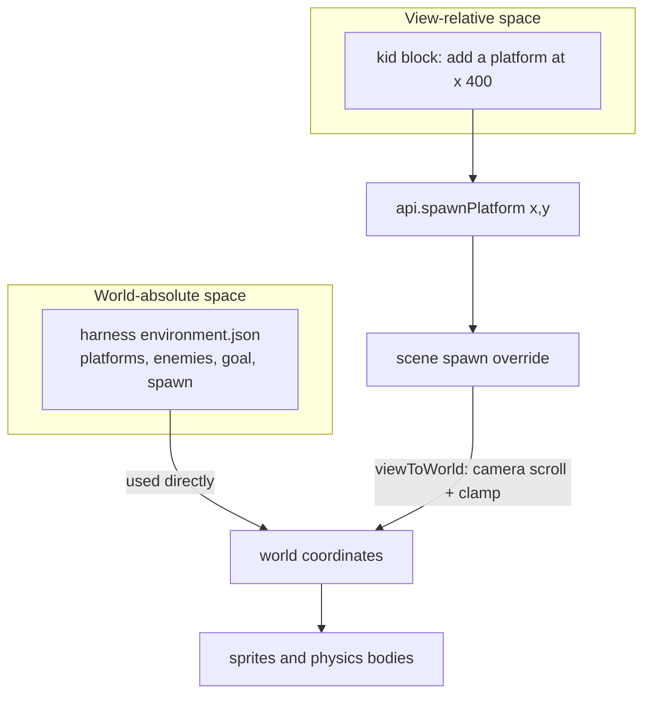
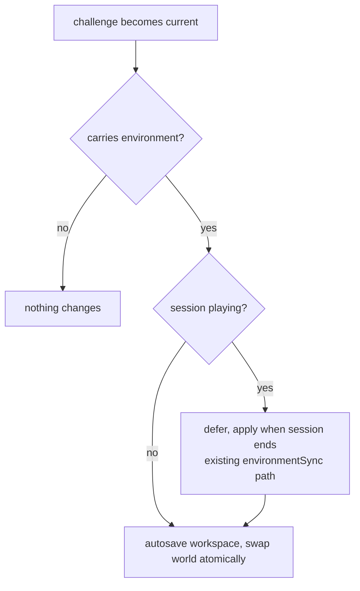

# Scrolling Worlds - Plan

## Goal Capsule

- **Objective:** Make `world.width`/`world.height` real — a camera that follows the player through worlds bigger than one screen, kid block coordinates that stay meaningful by anchoring to the visible view, and a late-arc challenge that teaches scrolling. This plan owns only the scrolling capability; multi-level campaigns and the 3D mode are not active scope.
- **Product authority:** This document. Product scope settled in dialogue on 2026-08-19; plan-level scope confirmed the same day.
- **Stop conditions:** Surface a blocker instead of guessing if implementation contradicts a requirement or a session-settled decision; details the plan leaves open are the implementer's judgment.
- **Open blockers:** None. All open questions are deferred (non-blocking).

---

## Product Contract

**Product Contract preservation:** unchanged from the requirements-only version.

### Summary

The harness can author worlds wider and/or taller than the 800×480 screen from the same layout data it writes today; the game camera follows the player through them. Kid block coordinates keep their 0–800/0–480 ranges but are interpreted relative to the current camera view, so every existing program, challenge, and saved game keeps its meaning. A new challenge appended late in the teaching arc introduces the scrolling world as a lesson.

### Problem Frame

The environment schema already carries `world.width` and `world.height` and validates any positive value, but nothing consumes them: the canvas is a hardcoded 800×480, the scene makes no camera calls beyond background colour, and block coordinate fields clamp to those same literals. A harness that writes `width: 4000` today gets a silently broken world rather than an error.

The cost is a generation ceiling: every kid prompt — "a ninja cat candy quest", "a dragon who bakes cakes" — mechanically flattens into a single static room. A quest reads as a journey; the engine can only stage a diorama. Scale is the most visceral improvement available to generated worlds, and the schema contract already promises it.

### Key Decisions

- KD1. **Both scroll axes are supported, not just horizontal.** (session-settled: user-directed — chosen over horizontal-only: the harness's expressive range is worth the extra camera and respawn surface.) Governs R1, R3.
- KD2. **Kid block coordinates are view-relative, not world-absolute.** (session-settled: user-directed — chosen over world-scaled absolute ranges: "the screen I'm looking at" is the child's mental model, and every existing program, hint, and saved game keeps its meaning.) Governs R4, R5, R6.
- KD3. **The teaching arc widens late, via a new appended challenge.** (session-settled: user-directed — chosen over keeping the starter world single-screen forever, or starting wide: the world growing becomes its own teachable moment, and early challenges keep the whole world visible while coordinates are learned.) Governs R9, R10.
- KD4. **2D now; a Minecraft-style 3D mode is a named future direction, not this scope.** (session-settled: user-directed — chosen over pivoting this work to 3D: ship the small prerequisite first; where a choice is free, schema concepts stay engine-agnostic rather than 2D-only, but no real effort is spent future-proofing.)

### Requirements

**Camera and world**

- R1. A world whose `world.width` or `world.height` exceeds the viewport scrolls: the camera follows the player and is bounded by the world, and physics bounds match the world, not the screen.
- R2. A world exactly matching the viewport (800×480) renders and plays exactly as today — no camera movement, no behaviour change.
- R3. World-size-derived behaviours read the world, not constants: fall-off respawn triggers relative to `world.height`, and the backdrop (sky, hills, clouds) covers the full world extent.

**Kid blocks**

- R4. Block coordinate fields keep their current 0–800 / 0–480 ranges and are interpreted relative to the current camera view: "x 400" means the middle of what the child sees, wherever the camera is.
- R5. Programs and worlds saved before this feature load and behave identically in single-screen worlds.
- R6. Blocks that run mid-session (timers, collect events) place spawns relative to the camera's position at that moment; challenge checks remain count-based and unaffected by where spawns land.

**Harness and schema**

- R7. Harness layout coordinates (platforms, collectibles, enemies, goal, spawn) remain world-absolute; the kid-view-relative interpretation applies only to block-program spawns.
- R8. World size is bounded by validation: a world exceeding the documented maximum fails loudly into the existing kid-language fallback rather than rendering broken, and `HARNESS.md` documents wide-world authoring, including the size bounds and reachability guidance.

**Teaching arc**

- R9. A new challenge appended late in the arc introduces scrolling: its bundled world is wider than one screen, the camera activates, and completing it requires journeying beyond the first screen. It works offline from bundled data like the rest of the arc.
- R10. The existing seven challenges are untouched, and saved progress migrates through the existing completed-ids reconciliation when the new challenge appears.

### Key Flows

- F1. Kid plays a wide generated world
  - **Trigger:** The harness answers a prompt with a world 3+ screens wide; the app hot-swaps it in.
  - **Steps:** The kid spawns at the start; the goal is not visible; running right scrolls the camera with them; new terrain and the goal reveal as they travel; falling below the world respawns them at spawn.
  - **Covers:** R1, R3, R7.
- F2. Kid's blocks build where they're looking
  - **Trigger:** A block program spawns a platform at "x 400, y 300" — once on start, once from a timer mid-run.
  - **Steps:** The on-start spawn lands mid-screen at the spawn view; later, with the camera scrolled two screens right, the timer fires and the platform lands mid-screen there — the kid paves the road ahead of themselves.
  - **Covers:** R4, R6.
- F3. The world grows as a lesson
  - **Trigger:** The kid completes the prior challenge and advances to the new scrolling challenge.
  - **Steps:** The bundled world for the challenge is wide; the challenge text names what changed ("your world just grew!"); the kid journeys to complete it; the arc then continues to free play.
  - **Covers:** R9, R10.

### Acceptance Examples

- AE1. **Covers R1.** Given a 2400×480 world, when the player runs right, then the camera follows, stops at the world edge, and the player collides with world bounds at x=2400, not x=800.
- AE2. **Covers R2, R5.** Given the bundled starter world (800×480) and a project saved before this feature, when it loads and plays, then rendering, physics, block behaviour, and challenge completion are indistinguishable from today.
- AE3. **Covers R4, R6.** Given the camera scrolled so the view starts at world x=1600, when a block spawns a platform at x 400, then the platform appears near world x=2000 — mid-screen in the current view.
- AE4. **Covers R8.** Given the harness writes a world beyond the documented maximum size, when the environment loads, then the world falls back with the existing kid-language message instead of rendering a broken world.
- AE5. **Covers R9.** Given a fresh install with no harness running, when the kid reaches the new scrolling challenge, then its wide bundled world loads offline and the challenge is completable.

### Success Criteria

- A harness-authored world at least three screens wide is completable end-to-end by a child using only existing blocks.
- The full existing unit and e2e suites pass with no changes other than deliberate additions for the new behaviour.
- The new scrolling challenge is completable offline on a fresh install.

### Scope Boundaries

**Deferred for later**

- Multi-level campaigns (`levels[]`, goal-advances-room) — this plan is their prerequisite, not their delivery.
- A player-relative "ahead of me" spawn block — polish on top of view-relative coordinates.
- Parallax backdrop layers, minimap, and camera juice beyond basic follow.

**Outside this plan's identity**

- The Minecraft/Roblox-style 3D voxel mode — a named future direction requiring its own brainstorm and a second engine; see How This Work Fits Together.

<!-- ce-section: work-relationships -->
### How This Work Fits Together

This plan owns the scrolling-world capability. The surrounding breakdown is the current understanding from the 2026-08-19 ideation pass (docs/ideation/2026-08-19-impressive-generated-games-ideation.html), not a committed roadmap:

- Multi-level campaigns — **Depends on** this plan's camera and world-size work; next candidate from the ideation ranking.
- Kind registry / creature composer, feel-as-data, bespoke challenge arcs — **Can proceed independently of** this plan; same wow-ladder, different axes.
- 3D voxel mode (Minecraft/Roblox-style) — **Still to decide**; would introduce a second engine and a redesigned kid surface, and deserves its own Deep brainstorm. This plan keeps schema concepts (world size, camera-view anchoring) engine-agnostic where the choice is free.

### Dependencies / Assumptions

- Assumes the engine's built-in camera-follow and bounds facilities are sufficient — no custom camera engineering anticipated.
- Assumes e2e fixtures and helpers are updated within this work where behaviour deliberately changes; view-relative semantics were chosen partly because they minimize this surface.

### Outstanding Questions

**Deferred to Planning** — resolved during planning; remaining items below are deferred to implementation:

- Camera feel: exact follow-smoothing values and whether vertical follow needs a different deadzone — tune during implementation (KTD1 sets the mechanism).

### Sources / Research

- docs/ideation/2026-08-19-impressive-generated-games-ideation.html — ideation doc this plan was seeded from (idea: "Cash In world.width").
- Verified current state (adversarially checked during ideation, re-confirmed during planning): `src/game/boot.ts` hardcodes 800×480 with `Scale.FIT` and no physics-world bounds config; `src/game/environmentSchema.ts` validates any positive world size; the only camera call in `src/game/PlatformerScene.ts` is background colour (line ~131), with zero `startFollow`/`setBounds`/`setScrollFactor` hits repo-wide; block coordinate clamps live only in `src/blocks/definitions.ts` (~127-151); `src/runtime/gameApi.ts` forwards spawn coordinates unclamped; fall-respawn reads `this.scale.height + 60` (~line 455); backdrop, clouds, rain, score pill, and win text all position off `this.scale.*`; `src/challenges/types.ts` has no environment field on challenges; `src/storage/projects.ts` saves the full environment per project.
- docs/plans/2026-08-12-001-feat-kid-game-builder-platformer-plan.md — the v1 plan whose KTD9 (harness writes data only) this work operates under.

---

## Planning Contract

### Key Technical Decisions

- KTD1. **World and camera bounds are always set from `env.world`, and camera follow is always on.** `buildWorld()` sets `physics.world.setBounds(0, 0, world.width, world.height)`, `cameras.main.setBounds(...)` the same, and starts follow on the player with gentle lerp. The physics world's bottom edge is left open (collision checks up/left/right only) so a falling player passes `world.height` and the respawn check fires; camera bounds stay fully closed. When the world equals the viewport the camera cannot move, which satisfies R2 with no mode flag or special case. Rationale: one code path, no "is scrolling on?" state to test. Cites R1, R2, R3.
- KTD2. **View→world translation is a pure helper, used only by the scene's spawn overrides.** (session-settled: user-directed, inherited from KD2 — chosen over translating in `gameApi`: the runtime API stays engine-agnostic and the camera is scene state.) Cites R4, R5, R6. A new `src/game/viewCoords.ts` exposes `viewToWorld(scrollX, scrollY, x, y, world)` (add camera scroll, clamp into world bounds); `PlatformerScene.spawnPlatform/spawnCollectible` translate before creating sprites. `src/blocks/definitions.ts` and `src/runtime/gameApi.ts` are untouched.
- KTD3. **World size maximum is 4800×2880 (six screens per axis), enforced in the Zod schema.** (session-settled: user-approved — chosen over unbounded: turns today's silent breakage into the existing loud kid-language fallback; cheap to raise later.) Cites R8.
- KTD4. **A challenge may carry a bundled environment; that is the arc-widening mechanism.** (session-settled: user-approved — chosen over a hardcoded second bundled world: data-driven and harness-editable, so any challenge can now ship a world; reuses the existing deferred-swap machinery.) Cites R9, R10. `challengeSchema` gains an optional `environment` field validated by the environment schema; when a challenge with one becomes current, the app applies it through the same path as a harness `environment_updated` (deferred while a session plays, autosave first). Precedence: saved progress records which challenge-carried environment was last applied; the world applies only on first transition into that challenge, and on boot a saved project's environment wins over the fetched harness file when the marker shows it was already applied — otherwise a reload would silently revert a mid-journey world.
- KTD5. **HUD pins to the camera; the backdrop draws to world size.** Score pill, win text, and celebration overlays get `setScrollFactor(0)`; the sky gradient covers `world.width × world.height`; hills tile across `world.width`; cloud drift wraps at `world.width`; the rain emitter spans the world width; the sun stays fixed within the sky gradient (parallax is deferred per Scope Boundaries). Cites R3.

### High-Level Technical Design

Two coordinate spaces meet at the scene boundary — the harness authors in world space, the kid programs in view space, and only the scene translates:

Challenge-carried environment application (KTD4) rides the existing swap machinery:

Directional guidance, not implementation specification — the implementer owns exact names and wiring.

### Assumptions

- Phaser 4's camera API matches the Phaser 3 shape used above (`startFollow`, `setBounds`, `setScrollFactor`). Verify at first implementation step; if it differs, the mechanism (bounded follow camera, pinned HUD) still holds — adjust calls, not design.

---

## Implementation Units

### U1. Bound world size in the schema and document wide-world authoring

**Goal:** Oversized worlds fail loudly into the existing fallback; the harness knows the new rules.
**Requirements:** R8 (per KTD3).
**Dependencies:** None.
**Files:** `src/game/environmentSchema.ts`, `src/game/environmentLoader.test.ts`, `HARNESS.md`.
**Approach:** Add `.max(4800)` / `.max(2880)` to `world.width`/`world.height`. The safeParse→fallback path already produces the kid-language message; no new error surface. Extend `HARNESS.md`: the bounds, that layout coordinates stay world-absolute, that kid block spawns are view-relative, and reachability guidance (every collectible/goal reachable by run+jump from spawn; jump clears ≈150px vertically at default strength).
**Test scenarios:**
- `Covers AE4.` Width 4800 validates; width 4801 falls back to the starter environment with `source: 'fallback'`.
- Height 2880 validates; height 2881 falls back.
- Defaults (800×480) still parse when `world` is omitted.
**Verification:** `npm test` green; `HARNESS.md` names the bounds.

### U2. Camera follow, world bounds, and world-sized presentation

**Goal:** Worlds larger than the viewport scroll with the player; single-screen worlds are pixel-identical to today.
**Requirements:** R1, R2, R3 (per KTD1, KTD5).
**Dependencies:** U1.
**Files:** `src/game/PlatformerScene.ts`.
**Approach:**
1. In `buildWorld()`, set physics world bounds and camera bounds from `env.world` (bottom physics edge open, per KTD1); start camera follow on the player with gentle lerp.
2. Pin HUD elements (score pill, win text, celebration overlays) with `setScrollFactor(0)` and position them off viewport size, not world size.
3. Size the backdrop to the world per KTD5 (sky gradient, hills tiling, cloud wrap, rain emitter span).
4. Change fall-respawn to trigger from `world.height + 60`.
**Execution note:** Verify the Phaser 4 camera API shape first (see Assumptions) with a quick manual run against a hand-widened `environment.json` before wiring the rest.
**Test scenarios:** Scene code has no unit-test harness (repo pattern: scene logic proves through e2e and extracted helpers). Covered by U6's e2e scenarios (AE1, AE2); no scene-level unit tests.
**Verification:** Manual: a hand-edited 2400×480 `environment.json` scrolls and clamps at the edge; the bundled starter world is visually unchanged; score pill stays put while scrolling; walking off the world's lowest edge respawns at spawn.

### U3. View-relative spawn translation

**Goal:** Kid block spawns land relative to the current camera view, clamped into the world.
**Requirements:** R4, R5, R6, R7 (per KTD2).
**Dependencies:** U2.
**Files:** `src/game/viewCoords.ts` (new), `src/game/viewCoords.test.ts` (new), `src/game/PlatformerScene.ts`.
**Approach:** Pure `viewToWorld(scrollX, scrollY, x, y, world)` helper; the scene's `spawnPlatform`/`spawnCollectible` overrides translate through it before creating sprites. Platform width passes through untranslated. Harness-authored entities (`buildWorld()` sprites) never pass through the helper — R7.
**Test scenarios:**
- Camera at origin: (400, 300) → (400, 300) — identity, which is R5's compatibility guarantee.
- Camera scrolled to (1600, 0): (400, 300) → (2000, 300). Covers AE3.
- Near the world's right edge: result clamps so the spawn stays inside world bounds.
- Vertical scroll: y translates and clamps symmetrically.
**Verification:** `npm test` green; manual: spawning from a timer while scrolled places the platform mid-view.

### U4. Challenge-carried environments

**Goal:** A challenge can bundle a world; becoming current applies it through the existing swap machinery.
**Requirements:** R9 mechanism, R10 (per KTD4).
**Dependencies:** U1.
**Files:** `src/challenges/types.ts`, `src/challenges/engine.ts`, `src/main.ts`, `src/challenges/engine.test.ts`.
**Approach:**
1. `challengeSchema` gains optional `environment` validated by the environment schema.
2. Engine exposes the current challenge's environment (if any).
3. `main.ts` applies it when the current challenge changes to one not yet applied — tracked by an applied-challenge marker on saved progress (per KTD4) — never on plain reload of an already-applied challenge, where the saved project's world wins over the fetched harness file.
4. If a session is playing at the transition: cancel it, await the world application, then restart — do not rely on the unawaited deferred-swap ordering. The environment-sync apply path gains a source parameter (fetched harness file vs provided challenge environment).
5. Apply only on transition into the challenge, not on every render, so a kid's own subsequent edits and harness updates are not overwritten.
**Test scenarios:**
- Advancing into a challenge that carries an environment applies it; advancing into one without leaves the world untouched.
- Loading a saved project whose marker shows the current challenge's environment was already applied keeps the saved world — the fetched harness file does not overwrite it on boot.
- Reloading mid-journey (marker set, wide world in the save) resumes the wide world.
- Advancing while a session is playing cancels, applies, then restarts — the new world is active when play resumes.
- Challenge JSON with an invalid embedded environment fails schema parse → challenges fall back to bundled starters (existing loader behaviour).
**Verification:** `npm test` green.

### U5. "The Great Journey" challenge content

**Goal:** The appended challenge that teaches scrolling, working offline.
**Requirements:** R9, R10 (per KD3).
**Dependencies:** U2, U3, U4.
**Files:** `src/challenges/starterChallenges.ts`, `game/environment/challenges.json`.
**Approach:** Append challenge 8: a 2400×480 bundled environment (embedded per KTD4) with terrain spread across three screens and the goal flag at the far end; check `win_triggered`; prompt/hints teach that the world is bigger than the screen ("run right to find the flag — your world just grew!"); full toolbox. The bundled world must satisfy U1's reachability guidance.
**Test scenarios:**
- The new challenge parses against the extended schema (bundled and mirrored JSON).
- Engine reconciliation: a save with 7 completed ids lands on the new challenge as current (existing insertion-migration test pattern).
- `Covers AE5.` Fresh state, no harness: the challenge's world loads from bundled data.
**Verification:** `npm test` green; manual playthrough of the journey offline.

### U6. Scrolling e2e coverage and regression pass

**Goal:** End-to-end proof of the scrolling behaviours; full suites green.
**Requirements:** AE1, AE2, AE3, AE5; Success Criteria.
**Dependencies:** U2, U3, U5.
**Files:** `e2e/scrolling.spec.ts` (new), `e2e/helpers.ts`, `src/main.ts` (dev-seam addition).
**Approach:** Extend the `window.__kidGame` dev seam with camera scroll + world size readouts. New spec writes a wide `environment.json` (same file-write pattern as the existing harness-edit e2e test, restoring it afterwards), then drives arrow keys.
**Test scenarios:**
- `Covers AE1.` Wide world: holding right increases camera scroll; scroll clamps at `world.width - 800`.
- `Covers AE2.` Starter world: camera scroll stays 0 through a full challenge-1 playthrough; existing specs pass unchanged.
- `Covers AE3.` With the camera scrolled, a view-relative spawn program places a platform in the current view (assert via seam: platform world x ≈ scroll + block x).
- `Covers AE5.` Playthrough spec extended (or new spec) reaching challenge 8 and completing the journey.
- `Covers R3.` In a wide/tall world, dropping past the world's lowest edge respawns at spawn (world-derived, not viewport-derived).
- `Covers R7.` With the camera scrolled, a harness-authored platform's world position matches its `environment.json` coordinates exactly (asserted via the dev seam).
**Verification:** `npx playwright test` fully green with no live kid session active.

---

## Verification Contract

| Gate | Command | Applies to |
|---|---|---|
| Types | `npm run typecheck` | all units |
| Unit tests | `npm test` | U1, U3, U4, U5 |
| Acceptance | `npx playwright test` | U2, U3, U5, U6 — never while a live kid session is active (tests wipe bridge queues) |
| Manual smoke | hand-widened `environment.json` scroll check | U2 |

---

## Definition of Done

- All ten requirements satisfied; AE1–AE5 demonstrably pass (AE4 via unit test, the rest via e2e or manual per unit verification).
- `npm run typecheck`, `npm test`, and `npx playwright test` all green.
- `HARNESS.md` documents world-size bounds, view-relative kid spawns, and reachability guidance.
- The bundled starter world and existing seven challenges behave identically to before (AE2).
- No leftover experimental or dead-end code from abandoned approaches in the diff.
